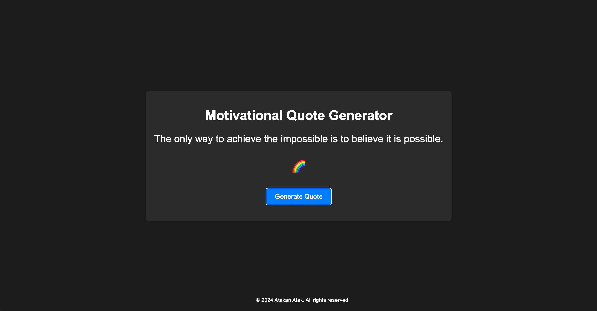
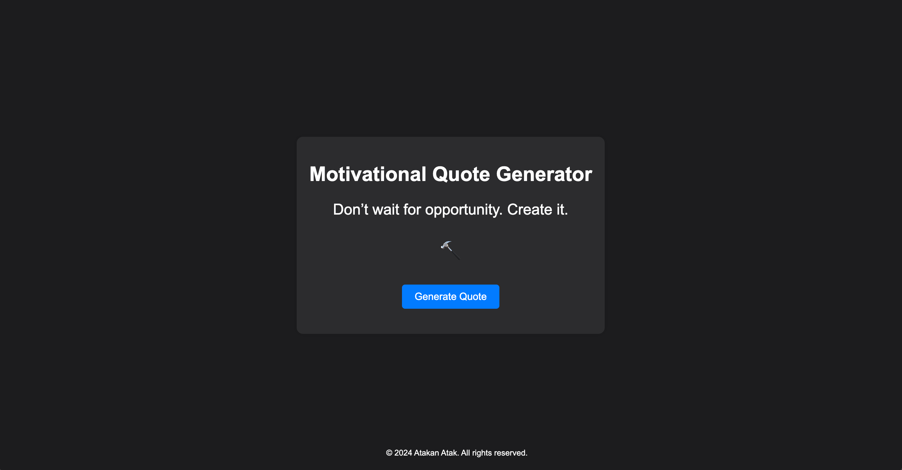

# Motivational Quote Generator

This is a simple web application that displays a random motivational quote along with an emoticon to set the mood for the day. Users can generate a new quote by clicking the "Generate Quote" button. The application randomly selects a quote from a list of 34 quotes and displays it on the screen.

## Demo
You can see the application live on GitHub Pages: [Motivational Quote Generator](https://atakanatakk.github.io/motivational-quote-generator/)

## Features
- Displays a random motivational quote with an emoticon.
- Simple and clean user interface.
- Generates a new quote with a single click.

## Technologies
- HTML
- CSS
- JavaScript
- GitHub Actions for continuous deployment

## Setup

To run this project locally, follow these steps:

1. Clone the repository
    ```sh
    git clone https://github.com/atakanatakk/motivational-quote-generator.git
    ```
2. Navigate to the project directory
    ```sh
    cd your-repo-name
    ```
3. Open `index.html` in your web browser
    ```sh
    open index.html
    ```

## Usage

To use the application, simply open it in your web browser and click the "Generate Quote" button to get a new motivational quote and emoticon.

## Deployment

The deployment to GitHub Pages is automated using GitHub Actions. Every time you push changes to the `main` branch, the workflow will build and deploy the project to GitHub Pages.

### GitHub Actions Workflow

The workflow is defined in `.github/workflows/deploy.yml`:

```yaml
name: Deploy to GitHub Pages

on:
  push:
    branches:
      - main

jobs:
  build:
    runs-on: ubuntu-latest

    steps:
      - name: Checkout repository
        uses: actions/checkout@v3

      - name: Set up Node.js
        uses: actions/setup-node@v3
        with:
          node-version: '14'

      - name: Install dependencies
        run: npm install

      - name: Build the project
        run: npm run build

      - name: Deploy to GitHub Pages
        uses: peaceiris/actions-gh-pages@v3
        with:
          github_token: ${{ secrets.GITHUB_TOKEN }}
          publish_dir: ./dist




